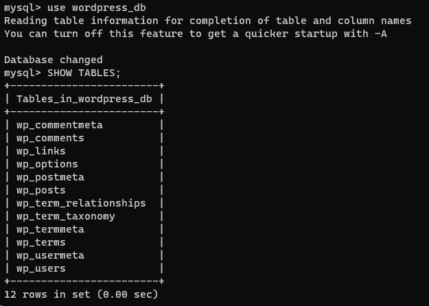

# Laboratory work nr. 2

### In this screenshot are represented the container and the image of the docker_db

### In this screenshot is the wordpress running on the specific ip address

### In this screenshot are all the tables in mysql on wordpress_bd database

