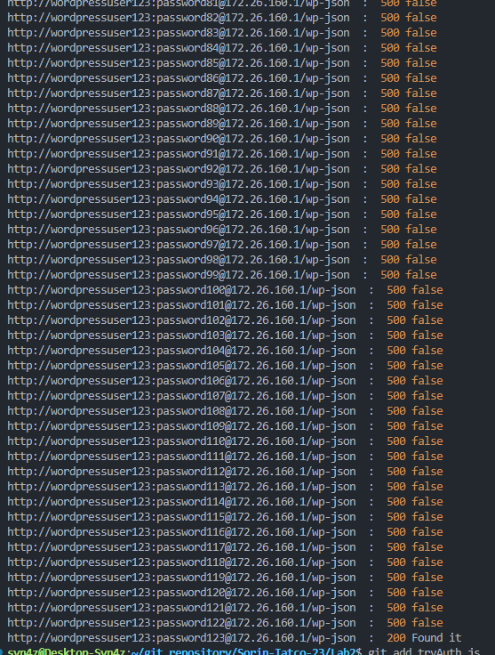
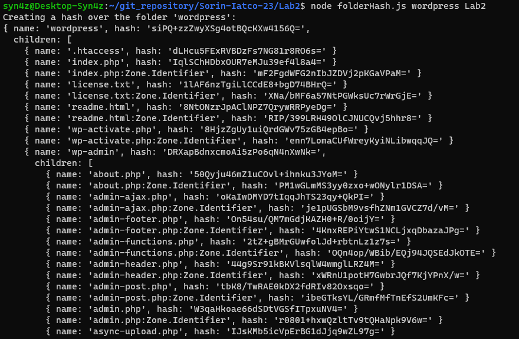
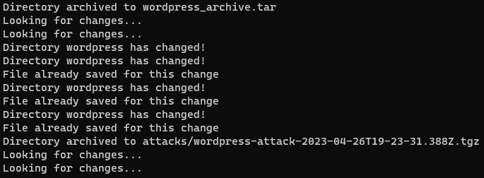
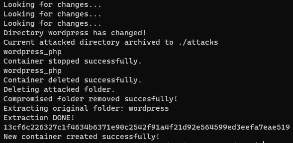

# Laboratory work nr. 3
## Task 1 results

## Task 2 
### Hashing the 'wordpress' folder

### Looking for changes and save the file to attacks with date and time

### Doing all the steps after identifieing a change
